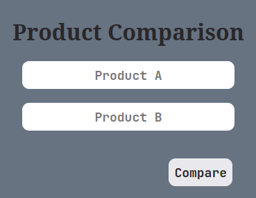
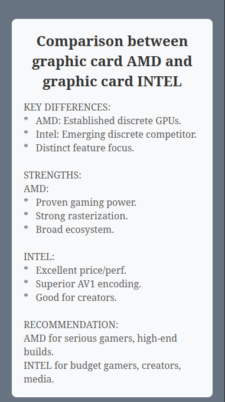

# 📊 Product Comparison


---

## 📖 Overview

This project is a web application designed to help users compare product features and prices. The main goal is to centralize information from various sources, enabling users to make better and more informed purchasing decisions.

---

## ✨ Features

-   **Real-time Product Search:** Instantly search for products across different providers.
-   **Detailed Comparison:** View side-by-side comparisons of product specifications and prices.
-   **Responsive UI:** A clean and modern user interface that works on any device.

---

## 🛠️ Tech Stack

-   **Backend:** Python with Flask framework.
-   **Libraries:**
    -   `Flask`
    -   `python-dotenv`
    -   `google-generativeai`

---

## 🚀 Installation and Setup

To get a local copy up and running, please follow these simple steps.

----
----
### Prerequisites

You will need Python 3 and pip installed on your machine.

### Installation

1.  Clone the repository:
    ```sh
    git clone https://github.com/JoaoPedroHenriquesB/productComparison.git
    ```
2.  Navigate to the project directory:
    ```sh
    cd productComparison
    ```
3.  Create and activate a virtual environment:
    ```sh
    python -m venv venv
    source venv/bin/activate  # On Windows, use `venv\Scripts\activate`
    ```
4.  Install the dependencies:
    ```sh
    pip install -r requirements.txt
    ```

----

### Images



----
### Running the Application

1.  Set up your environment variables by creating a `.env` file.
2.  Start the Flask development server:
    ```sh
    flask run
    ```
3.  Open your browser and go to `http://127.0.0.1:5000` to see the application in action.
